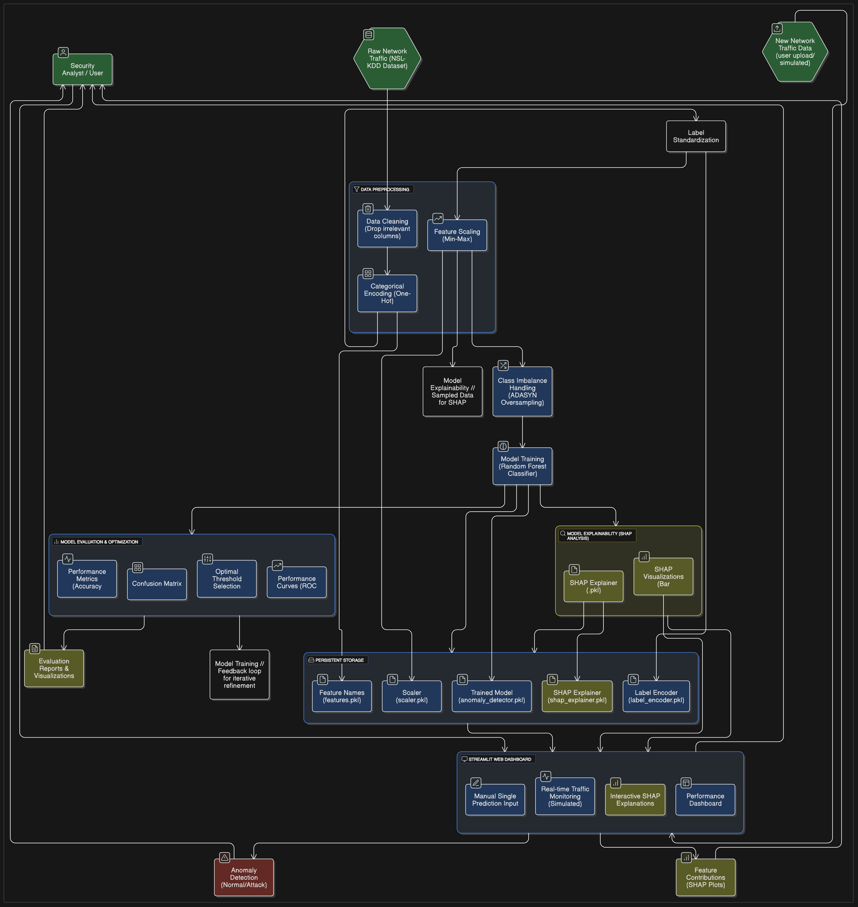

# CyberShield AI: Network Anomaly Detection System with Explainable AI

## Table of Contents
- [About the Project](#about-the-project)
- [Problem Statement](#problem-statement)
- [Objectives](#objectives)
- [Key Features](#key-features)
- [Project Report](#project-report)
- [System Architecture Overview](#system-architecture-overview)
- [Dataset](#dataset)
- [Methodology Highlights](#methodology-highlights)
- [Performance Metrics Highlights](#performance-metrics-highlights)
- [Explainability (SHAP) Highlights](#explainability-shap-highlights)
- [Dashboard (Streamlit) Highlights](#dashboard-streamlit-highlights)
- [Getting Started](#getting-started)
  - [Prerequisites](#prerequisites)
  - [Installation](#installation)
  - [Running the Project](#running-the-project)
    - [1. Generate Model Artifacts & Plots (Optional but Recommended)](#1-generate-model-artifacts--plots-optional-but-recommended)
    - [2. Run the Streamlit Dashboard](#2-run-the-streamlit-dashboard)


## About the Project

This repository hosts **CyberShield AI**, an advanced **Network Anomaly Detection System** that integrates **Machine Learning** with **Explainable AI (XAI)**. Its primary goal is to identify novel and sophisticated cyber-attacks within network traffic, including encrypted data, where traditional signature-based detection methods often fall short. Beyond mere detection, the system provides **human-understandable explanations** for its predictions, empowering cybersecurity analysts with transparent and actionable insights to enhance decision-making and incident response.

## Problem Statement

The escalating complexity of cyber threats and the pervasive use of encryption in network communications pose formidable challenges for conventional intrusion detection systems. These systems frequently struggle to detect unseen attack patterns and typically offer minimal transparency into their decision-making processes, hindering efficient and effective incident response. This project directly addresses these gaps by developing a robust, interpretable, and user-friendly anomaly detection solution.

## Objectives

* **Effective Anomaly Detection:** Implement robust machine learning models to accurately identify network anomalies.
* **Explainable AI (XAI) Integration:** Provide clear, human-understandable explanations for model predictions using SHAP values.
* **Interactive Web Dashboard:** Develop an intuitive Streamlit application for real-time predictions, interactive visualizations, and comprehensive system insights.
* **Foundation for Future Research:** Establish a strong base for future advancements, including potential explorations into zero-shot learning for novel threat detection.

## Key Features

* **High-Performance Detection:** Utilizes a **Random Forest Classifier** known for its robustness and accuracy in handling complex network data.
* **Advanced Imbalance Handling:** Employs **ADASYN oversampling** to specifically tackle class imbalance, ensuring high recall for rare attack types.
* **Deep Interpretability with SHAP:** Integrates **SHAP (SHapley Additive exPlanations)** to dissect model decisions, showing individual feature contributions to each prediction and global feature importance.
* **Comprehensive Streamlit Dashboard:**
    * Allows **CSV file uploads** for on-demand anomaly analysis.
    * Provides **real-time predictions** and **interactive SHAP explanations**.
    * Displays **key model performance metrics** and evaluation plots.
* **Full Project Transparency:** All training scripts, pre-trained models, preprocessing artifacts, detailed project report, and visualizations are included for complete understanding and reproducibility.

## Project Report

For an in-depth understanding of the project, including detailed explanations of the dataset, methodologies, algorithms, SHAP analysis, code snippets, and comprehensive evaluation results, please refer to the **`project_report.pdf`** file located in the root of this repository. It provides a full walkthrough of every major component and step.

## System Architecture Overview

The CyberShield AI system follows a well-defined pipeline, designed for clarity and efficiency from raw data to actionable insights.


*(The `system_architecture.png` diagram provides a visual representation of this flow.)*

The core components include:
* **Raw Data Ingestion:** Network traffic from the NSL-KDD dataset.
* **Data Preprocessing:** Cleaning, One-Hot Encoding categorical features, Min-Max Scaling numerical features, and Label Standardization (Normal/Attack).
* **Class Imbalance Handling:** Applying ADASYN to balance the training data for minority attack classes.
* **Model Training:** Training a Random Forest Classifier.
* **Model Evaluation:** Rigorous assessment using various metrics and curve analyses.
* **Model Explainability:** SHAP analysis for both global and local prediction interpretations.
* **Persistent Storage:** Saving all trained models and preprocessing artifacts (`.pkl` files) for deployment.
* **Streamlit Web Dashboard:** The user interface for interaction, real-time prediction, and visualization of explained anomalies.
* **Security Analyst Interaction:** User input for analysis and feedback for continuous system improvement.

## Dataset

The project utilizes the **NSL-KDD Dataset**, a widely recognized benchmark for network intrusion detection. It is an improved version of the KDD'99 dataset, addressing its inherent issues such as redundant training records and duplicate test records, which can lead to biased model evaluation.

The dataset comprises **41 features** describing network connection records (e.g., duration, protocol type, service, flag, byte counts, error rates) and a `label` indicating 'normal' or a specific type of 'attack' (e.g., DoS, Probe, R2L, U2R). For this project, all attack labels are consolidated into a single **'attack'** class for binary classification.

**Source:** [NSL-KDD Dataset on Kaggle](https://www.kaggle.com/datasets/hassan06/nslkdd)

## Methodology Highlights

The project follows a comprehensive Machine Learning pipeline:

1.  **Data Preparation:** Robust cleaning, feature engineering (One-Hot Encoding, Min-Max Scaling), and label standardization.
2.  **Imbalance Correction:** Strategic use of **ADASYN** to oversample the minority 'attack' class, ensuring the model effectively learns rare patterns.
3.  **Model Selection & Training:** Utilizing the powerful **Random Forest Classifier** for its ensemble learning capabilities, trained on the preprocessed and balanced NSL-KDD data.
4.  **Rigorous Evaluation:** Comprehensive assessment using a variety of metrics (Precision, Recall, F1-Score, AUC, FPR) and curves (ROC, Precision-Recall), with **optimal threshold selection** to fine-tune classification.
5.  **Explainability with SHAP:** Applying SHAP to interpret feature contributions for individual predictions and global feature importance.
6.  **Artifact Persistence:** Saving all trained components and preprocessing tools (`.pkl` files) to facilitate seamless deployment.

## Performance Metrics Highlights

The model demonstrates strong performance in detecting network anomalies:

* **Accuracy:** ~92.09%
* **Precision:** ~88.15%
* **Recall:** ~99.48% (Crucial for minimizing missed attacks)
* **F1 Score:** ~93.47% (Balanced metric)
* **Average Precision (PR-AUC):** ~96.83%
* **False Alarm Rate (FPR):** ~17.67%


## Explainability (SHAP) Highlights

SHAP is instrumental in providing transparency:

* **Global Feature Importance:** Identifies the most influential features overall.
* **Detailed Feature Impact:** Shows how each feature's value affects predictions for specific instances (e.g., high `src_bytes` pushing towards 'attack').
* **Individual Prediction Breakdown:** Explains exactly why a single network connection was classified as an anomaly.

## Dashboard (Streamlit) Highlights

The Streamlit dashboard (`main_dashboard.py`) offers an intuitive way to interact with the system:

* **User-friendly Interface:** Easy navigation for analysis and monitoring.
* **Dynamic Visualizations:** Presents model performance, SHAP explanations, and threat summaries.
* **Interactive Simulation:** Upload new data (`.csv` files) or run on pre-sampled test data for immediate predictions and detailed explanations.

## Getting Started

Follow these steps to set up the project and run the Streamlit dashboard on your local machine.

### Prerequisites

* **Python 3.8 or higher** is recommended.
* `pip` (Python package installer)

### Installation

1.  **Clone the repository:**
    ```bash
    git clone [https://github.com/mab2004/shap-anomaly.git](https://github.com/mab2004/shap-anomaly.git)
    cd shap-anomaly
    ```

2.  **Install required Python libraries:**
    The project relies on several key libraries. 
    ```bash
    pip install numpy pandas scikit-learn seaborn shap streamlit imblearn tqdm
    ```

### Running the Project

#### 1. Generate Model Artifacts & Plots (Optional but Recommended)

The repository includes pre-generated `.pkl` model artifacts and plots. However, if you wish to retrain the model or regenerate the visuals, run the training script first.

* Ensure the NSL-KDD dataset files (`KDDTrain+.TXT` and `KDDTest+.TXT`) are placed in the directory.
* Execute the training script:
    ```bash
    python project.py
    ```

    This will generate:
    * `anomaly_detector.pkl`
    * `scaler.pkl`
    * `label_encoder.pkl`
    * `features.pkl`
    * `shap_explainer.pkl`
    * `model_metrics.pkl`
    * `performance_curves.png`
    * `shap_feature_importance.png`
    * `shap_detailed_impact.jpg`
    * `shap_waterfall_example.png`
      
#### 2. Run the Streamlit Dashboard

Once dependencies are installed and artifacts are available, you can launch the interactive dashboard:

```bash
streamlit run main_dashboard.py
